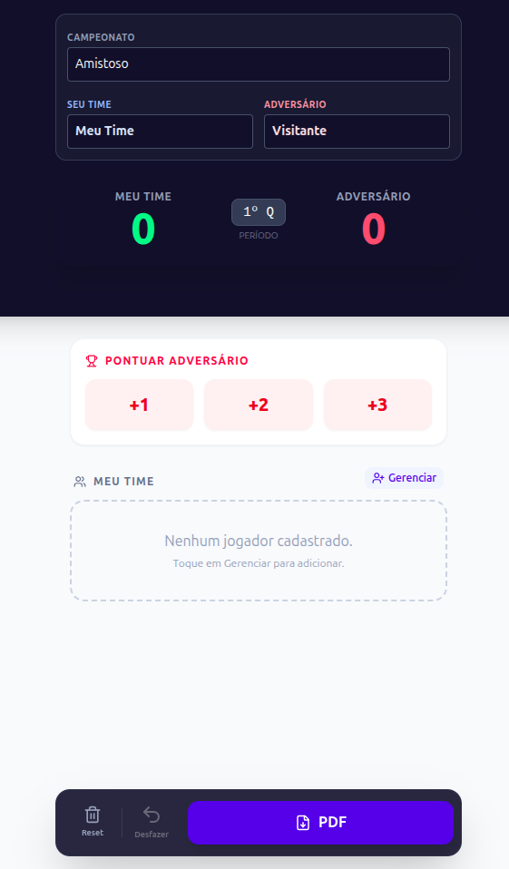

# 🏀 Scout Basquete

Aplicação desenvolvida para uma escolinha de basquete com o objetivo de **registrar estatísticas da partida em tempo real**.  
O sistema permite que o scouter acompanhe o desempenho dos jogadores e, ao final do jogo, gere um **relatório em PDF com os dados individuais**.

---

## 📸 Preview



---

## 🚀 Sobre o projeto

Este projeto foi criado para uso prático em uma escolinha de basquete, facilitando o trabalho de coleta de estatísticas durante as partidas.

Com a aplicação, o scouter pode:

- ✅ Registrar pontos dos jogadores  
- ✅ Registrar pontos dos adversários  
- ✅ Acompanhar estatísticas em tempo real  
- ✅ Gerar relatório final em PDF  
- ✅ Visualizar desempenho individual dos atletas  

O sistema automatiza um processo que normalmente seria feito manualmente, trazendo **mais organização, rapidez e precisão** para a análise das partidas.

---

## 🧠 Funcionalidades

- 🏀 Controle de pontuação do time  
- 🆚 Registro de pontos do adversário  
- 👤 Estatísticas individuais por jogador  
- 📊 Acompanhamento durante a partida  
- 📄 Geração de relatório em PDF ao final do jogo  
- ⚡ Interface rápida para uso em quadra  

---

## 🛠️ Tecnologias utilizadas

- **Next.js**  
- **TypeScript**  
- **JavaScript**  
- **Tailwind CSS**  
- **Vercel** (deploy)

---

## 📂 Estrutura do projeto

```
app/        → páginas da aplicação
public/     → arquivos estáticos
types/      → tipagens TypeScript
utils/      → funções auxiliares
```

---

## ▶️ Como executar o projeto

```bash
# Clone o repositório
git clone https://github.com/Gobson995/Scout-Basquete

# Acesse a pasta
cd Scout-Basquete

# Instale as dependências
npm install

# Rode o projeto
npm run dev
```

A aplicação estará disponível em:

```
http://localhost:3000
```

---

## 🌐 Deploy

O projeto está publicado em:

👉 https://scout-basquete.vercel.app

---

## 🎯 Objetivo

O principal objetivo deste projeto foi:

- Aplicar conhecimentos de desenvolvimento web moderno  
- Criar uma solução real para o contexto esportivo  
- Praticar geração de relatórios em PDF  
- Trabalhar com tipagem usando TypeScript  
- Simular uma aplicação de uso em produção  

---

## 📌 Possíveis melhorias futuras

- 📱 Melhor responsividade mobile  
- 📈 Mais métricas por jogador  
- 🔐 Sistema de autenticação  
- 🏆 Histórico de partidas  
- ☁️ Persistência em banco de dados  

---

## 👨‍💻 Autor

Desenvolvido por **Gustavo Bada Zanatta**

🔗 GitHub: https://github.com/Gobson995

---

# ⭐ Se este projeto te ajudou

Considere deixar uma ⭐ no repositório — isso ajuda muito!
